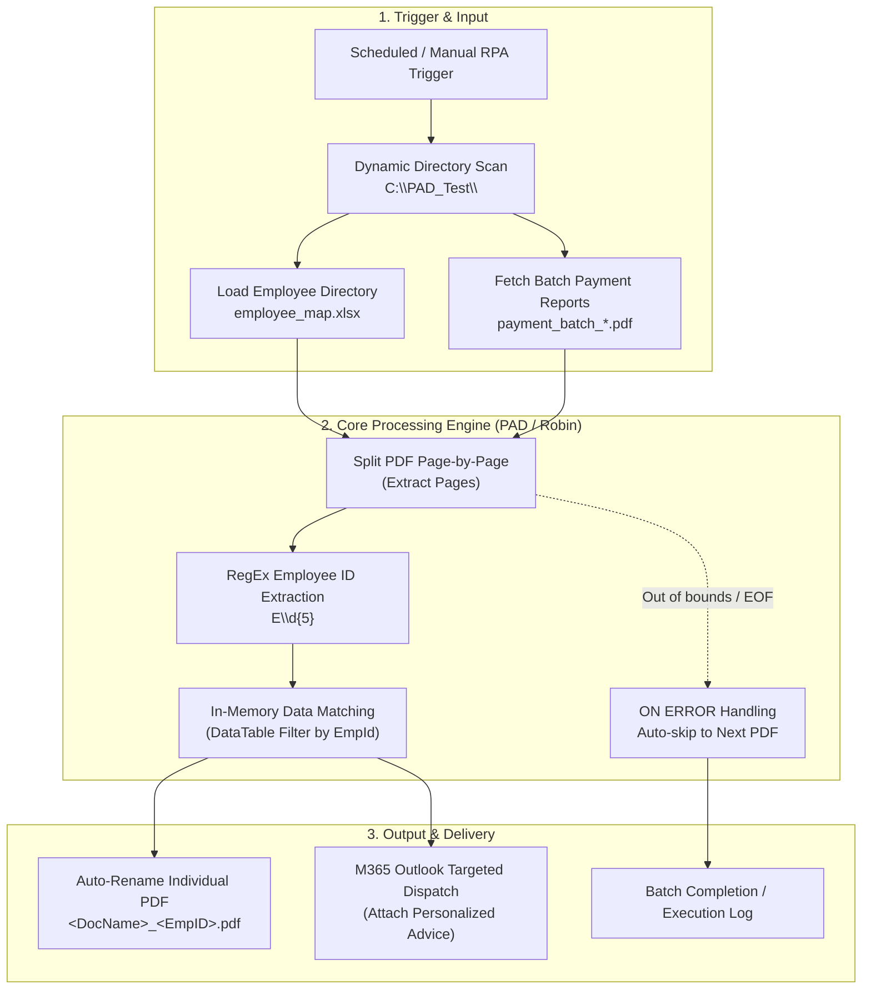

<div align="center">

# PAD Payment PDF Splitter & Sender

🌐 **[繁體中文 (Traditional Chinese)](README.md)** | **[English](README_EN.md)**

<br/>

[](https://powerautomate.microsoft.com/)
[](#)
[](https://www.microsoft.com/microsoft-365)
[](https://www.microsoft.com/microsoft-365/excel)
[](#)
[](#-note)

</div>

An RPA workflow developed with **Power Automate Desktop (PAD)** and **Microsoft 365 Outlook**. Currently applied in production across enterprise group subsidiaries to automate the splitting of consolidated batch payment PDF reports and dispatch personalized payment advice to employees.

---

## 📌 Background & Practical Value

During monthly financial settlement, consolidated payment proposal reports (PDF) containing all employee records are generated. Manually splitting pages, checking employee IDs, and drafting individual emails is time-consuming and carries a high risk of sending confidential payroll data to the wrong person.

This workflow fully automates the process across group subsidiaries, cutting processing time from 30 minutes to under 30 seconds per batch with zero delivery errors.

---

## ⚙️ Workflow Logic



* **Multi-Company Dynamic Scanning**: Discovers company subdirectories under `C:\PAD_Test\`. New entities are onboarded simply by adding their folder and Excel mapping file.
* **PDF Page Splitting & ID Extraction**: Extracts pages sequentially and extracts employee IDs using RegEx (`E\d{5}`), auto-renaming outputs to `<DocName>_<EmpID>.pdf`.
* **Data Isolation & Secure Dispatch**: Loads employee mappings into isolated in-memory tables per entity and sends notifications directly via local M365 Outlook.
* **Error Handling**: Uses `ON ERROR -> GOTO NextPdf` to detect end-of-document conditions smoothly without interrupting batch execution.

---

## 📁 Directory Standard

```text
C:\PAD_Test\
├── Company_A\
│   ├── payment_batch_01.pdf   # Source consolidated PDF
│   ├── employee_map.xlsx      # Email directory (Columns: EmpId, Email)
│   └── Output\                # Split individual PDFs (e.g., payment_batch_01_E00001.pdf)
└── Company_B\
    ├── payment_batch_02.pdf
    ├── employee_map.xlsx
    └── Output\
```

---

## 🚀 How to Run (PAD Import)

1. Create a new flow in **Power Automate for Desktop**.
2. Open [`src/flow.robin`](src/flow.robin), select all and copy (`Ctrl + A` ➔ `Ctrl + C`).
3. Paste (`Ctrl + V`) directly onto the PAD designer canvas.
4. Prepare folders under `C:\PAD_Test\` with your test files (see `sample_data/` for templates) and run.

---

## 🔒 Note
All sample data, employee names, and email domains in this public repository have been sanitized.
